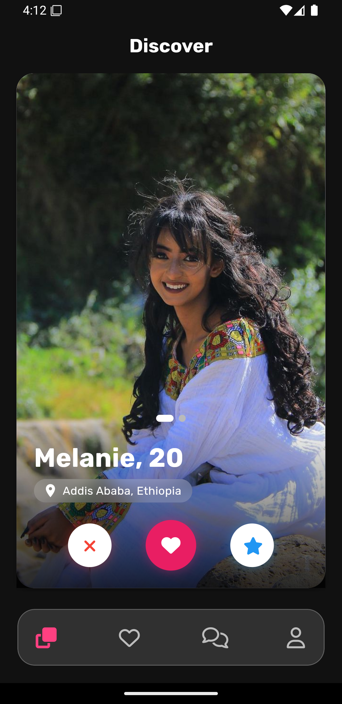
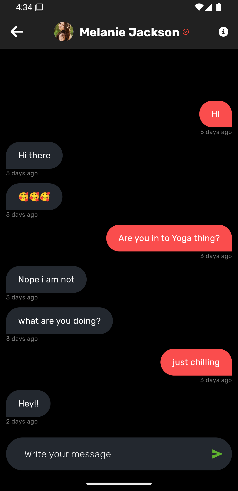

# ❤️ Selam Dating App

Selam Dating App is a modern and engaging mobile application built using **Flutter** and **Firebase**. It connects people in meaningful ways, making dating seamless, fun, and interactive.


---

## 📌 Features

✅ **Profile Creation** – Users can create profiles with photos, interests and bios.  
✅ **Real-time Chat** – Integrated Firebase Firestore chat for instant messaging.  
✅ **Swipe & Match** – A Tinder-like swipe feature for finding matches.  
✅ **Image Upload** – Users can upload images from their gallery or camera.  
✅ **Location-Based Matching** – Find people nearby using location services.  
✅ **Dark Mode Support** – Beautiful UI in both light and dark modes.
✅ **Local Authentication Support** – Users can secure their account using passcode or fingerprint authentication.

---

## 🛠️ Tech Stack

- **Frontend:** Flutter (Dart)
- **Backend:** Firebase Authentication, Firestore, Firebase Storage
- **State Management:** BLoC
- **Database:** Firebase Firestore

---

## 📸 Screenshots

| Home Screen                            | Chat Screen                            | Profile Setup                                |
| -------------------------------------- | -------------------------------------- | -------------------------------------------- |
|  |  |  |

---

## 🚀 Installation & Setup

1️⃣ **Clone the repository**

```sh
git clone https://github.com/kecheste/Selam-Android.git
cd Selam-Android
```

2️⃣ **Install dependencies**

```sh
flutter pub get
```

3️⃣ **Run the app**

```sh
flutter run --dart-define=NOTIFICATION_SERVER_KEY="Firebase messaging notification server key"
```

> ⚠️ Ensure you have Firebase configured for Android before running the app.

---

## 💡 How to Contribute

I welcome contributions! Follow these steps:

1. Fork the repository
2. Create a new branch (`feature/your-feature`)
3. Commit your changes
4. Push to your branch
5. Open a Pull Request

---

### ✨ Made with ❤️ by Abenezer Tesfaye
